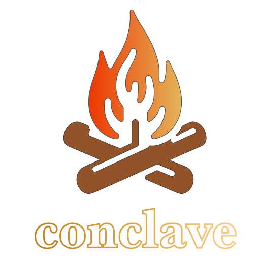

<h1 align="center">
    
</h1>

# Introduction

> conclave: a private meeting

Very basic lobby system written in C99.

Consists of:

* [Conclave Daemon](https://github.com/piot/conclave-daemon)
* [Conclave Server Lib](https://github.com/piot/conclave-server-lib)
* [Conclave Serialize](https://github.com/piot/conclave-serialize-c)
* [Conclave Client](https://github.com/piot/conclave-client-c)

Uses [Guise](https://github.com/piot/guise) for authentication.
